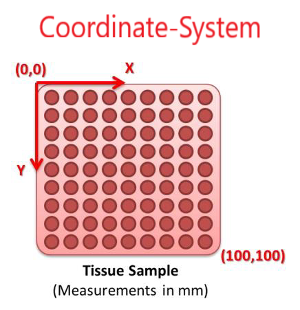
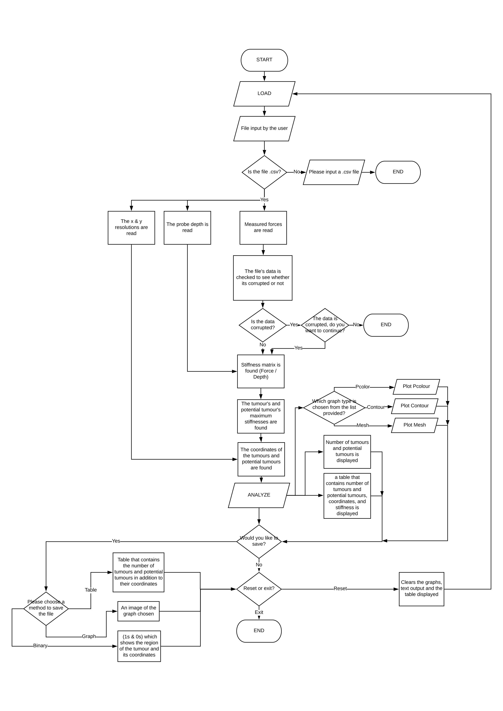

# The Palpatronix

## Introduction
This project was based on a system called 'The Palpatronix'[^1], developed by PhD students at the University of Leeds to overcome the drawbacks of Minimally Invasive Surgeries; which restricted the doctors from palpating the tissues to identify any abnormalities such as tumours. 

The Palpatronix system divides a tissue sample into a grid with x and y coordinates and then palpates the tissue using a sensory probe to collect force data in each of these coordinates. The force data is then stored in an array in a CSV file, which can then be analysed for tumours.

  

<b>Figure 1:</b> Palpatronix coordinate system.

A tumour in a tissue sample has a much higher stiffness than its surrounding tissue and so a very simple idea in statistics was used to identify the tumours. Data in nature is found to be normally distributed and this meant that 99% of all data in a sample lies between ±3 standard deviations. As such any data that was greater than 3 standard deviations was classed to be as an anomaly or in this case a tumour. Using this threshold, the tumours were found and their locations.  

As a part of this project, a MATLAB code and a graphical user interface were programmed that detected and displayed all the possible tumours in a tissue sample (CSV file).

## Program Flowchart

To run the code use `TumourDetection.m` file, which will open up the user interface.

<b>Figure 2:</b> Program flowchart.

[^1]: https://www.dailymail.co.uk/sciencetech/article-2027041/Palpatronix-Surgeons-future-feel-tumours-key-hole-surgery-thanks-haptic-scalpel.html
